# 🎉 派对接力 · PartyRelay

A local, offline, pass-the-phone party game for two teams. SwiftUI · iOS 17+ · zero dependencies, zero network calls.

Split into Red Team vs Blue Team, spin the wheel for a game, race to guess words before the timer runs out, and let the built-in catch-up system quietly keep a blowout from turning into a boring rest of the night.

<p align="center">
  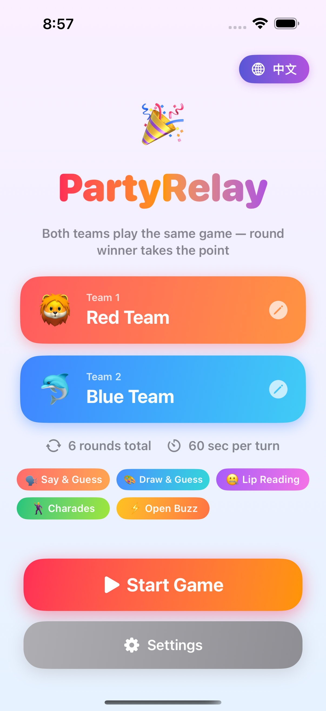
  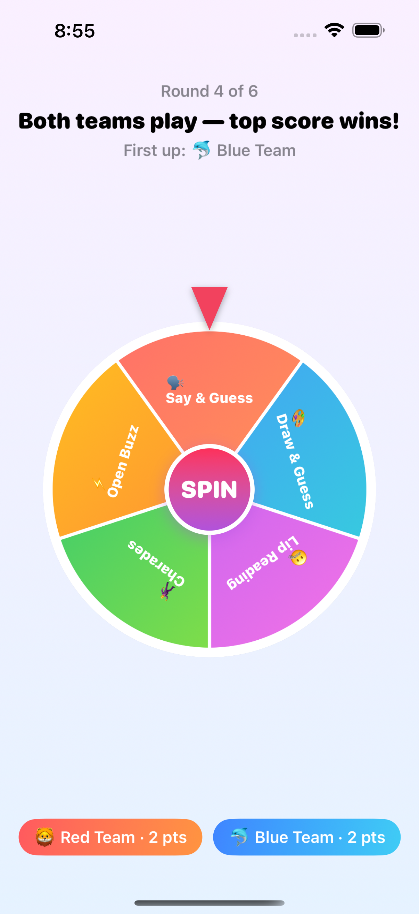
  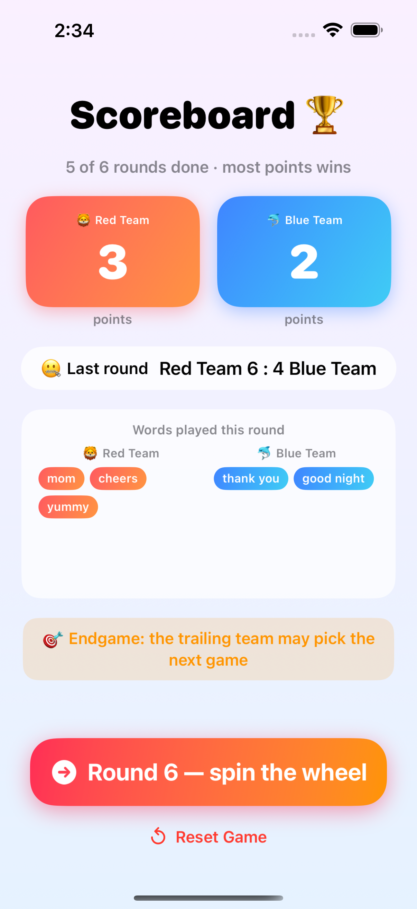
  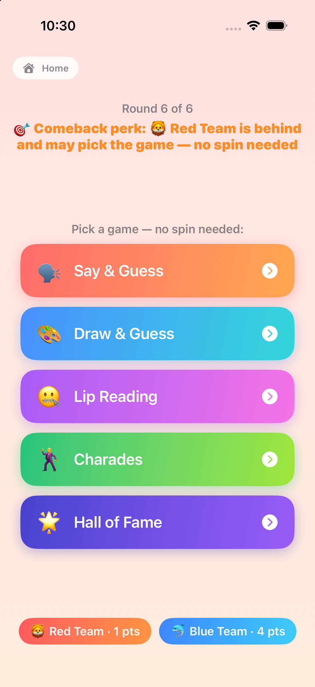
</p>

<p align="center">
  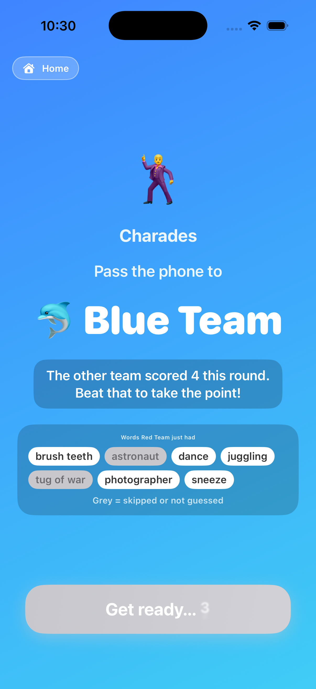
  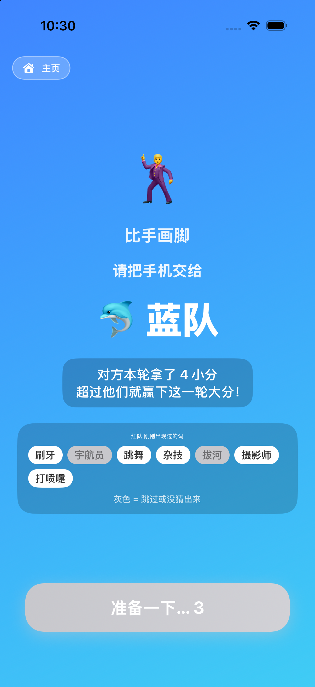
</p>

<p align="center">
  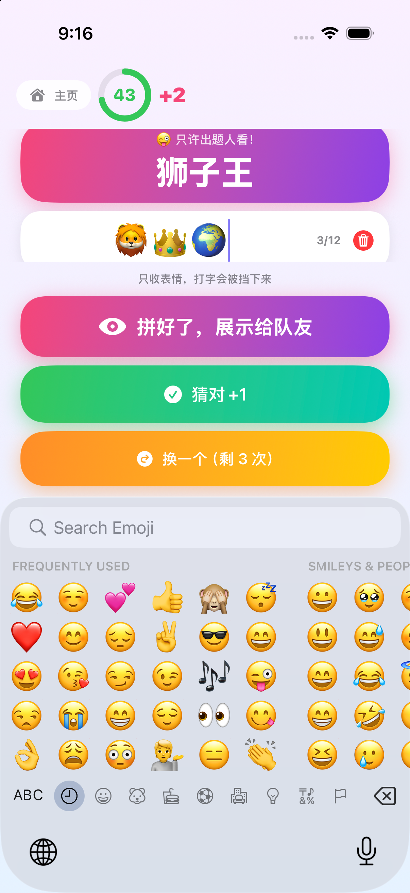
  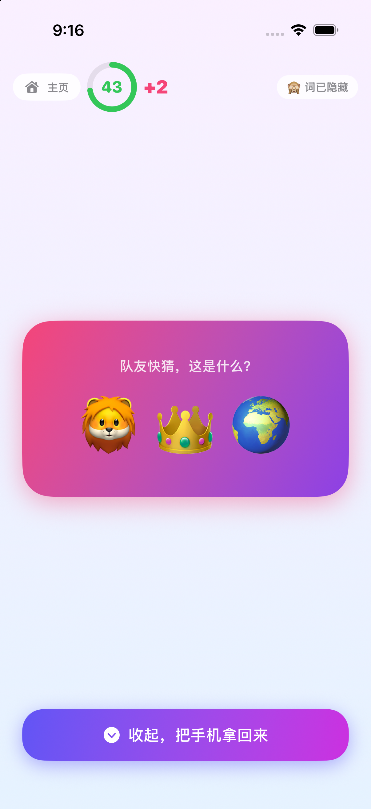
  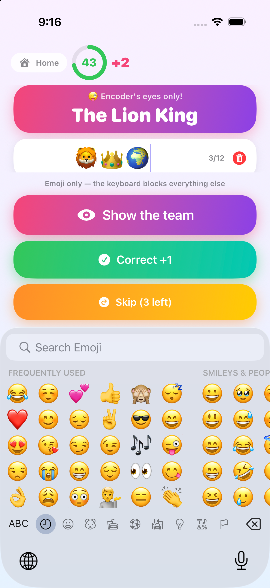
</p>

<p align="center">
  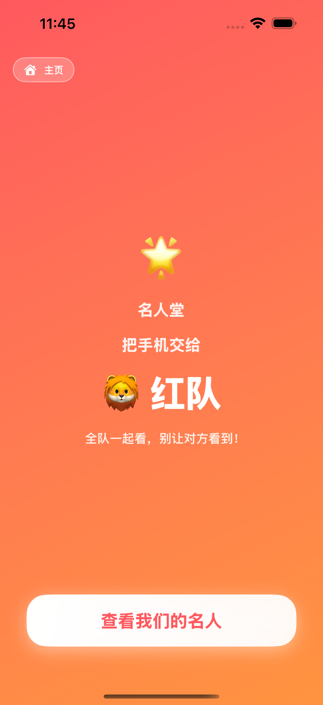
  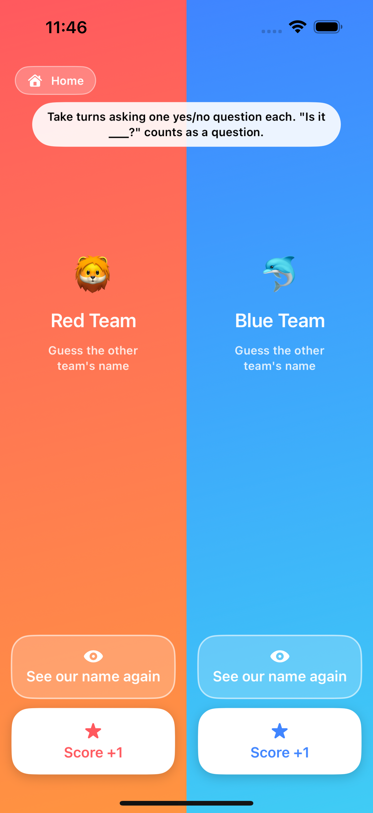
  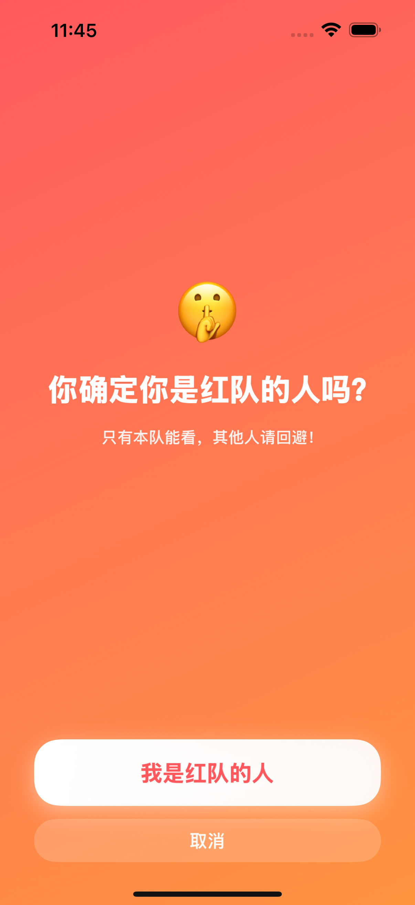
  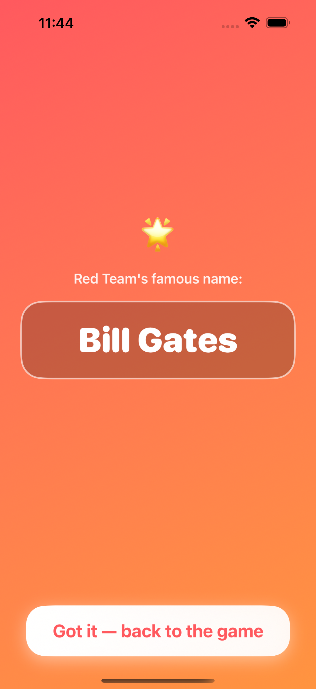
</p>

More screenshots (Chinese UI, settings, Open Buzz, privacy guard, drawing canvas, Emoji Manager, Hall of Fame) are in [`Screenshots/`](Screenshots).

---

## Gameplay

### The six games

| | Game | How it works |
|---|---|---|
| 🗣️ | **Say & Guess** | One player describes the word out loud — without saying any character/word that's literally in it — while the rest of the team guesses. |
| 🎨 | **Draw & Guess** | One player sketches the word on an in-app canvas (no letters or numbers), teammates guess from the same screen. |
| 🤐 | **Lip Reading** | One player mouths the word silently — no sound at all — and the team reads their lips. |
| 🕺 | **Charades** | One player acts the word out with gestures only, no sound. |
| 😜 | **Emoji Manager** | One player spells the word out in emoji (emoji-only input field, system emoji keyboard), then hides the word and shows the team nothing but the emoji. |
| 🌟 | **Hall of Fame** | Both teams play at once, no timer: each team is secretly assigned a famous name (celebrity or fictional character), then they take turns asking each other yes/no questions until someone guesses the other team's name. |

The first five pull from their own hand-written word list (not machine translated), split into 3 internal difficulty tiers that quietly get harder as the match progresses. A word that has come up once never comes up again — see [Never the same word twice](#never-the-same-word-twice) below.

### 😜 Emoji Manager — spell it in emoji

Emoji Manager is Draw & Guess turned inside out. Instead of drawing in front of everyone, the player holding the phone privately sees the word (a name, an idiom, or a movie / TV / cartoon title) and spells it out in emoji on the **system emoji keyboard** — so emoji *search* is right there, which beats scrolling a hand-rolled grid. The input field itself is the rule: it accepts nothing but emoji (typing, pasting and dictation are all filtered out, up to 12 emoji per word), so there's no way to sneak the answer in as text. Every time an emoji lands in the field the keyboard is rebuilt (a same-runloop resign/become, so it never animates away), which clears the emoji keyboard's search box — otherwise iOS keeps the last query around and you'd have to delete it by hand before searching for the next one.

Tapping *Show the team* hides the word and freezes the screen into nothing but the emoji — no keyboard, no editing, no scoring buttons, so the phone can sit on the table or face the room without anything to fiddle with. To change the code you have to take the phone back and tap the one button there is, which returns to the word screen where the scoring buttons (correct / sniped / skip) live — the same split Draw & Guess uses.

Timing is the same single clock every other game uses: one *Time per turn* countdown for the whole turn, running from the moment the team takes the phone until it hits zero. Hunting for emoji spends that clock like anything else does — dawdle on the keyboard and there is less time left to guess — so the same ring shows on both the word screen and the display screen. Because that makes Emoji Manager the slowest game per word, *Time per turn* goes up to 10 minutes (see Settings below).

### 🌟 Hall of Fame — the whole-team game

Hall of Fame breaks the usual turn structure: nobody hands the phone back and forth for a timed turn. Red privately sees their assigned name, then Blue does, then the phone sits on the table showing a **split screen — red on the left, blue on the right**. Each half has *See our name again* (which covers the whole screen in that team's colour, asks "Are you sure you're on the Red team?", then reveals the name) and *Score*, which covers the screen the same way and asks for a confirmation before ending the round. Names come from two separate curated pools — one of names a Chinese audience knows, one for English speakers — and both names are drawn together from the pool of names that have never come up on this phone, so the two teams always get different names and neither has been used before.

### ⚡️ Open Buzz — not a game, a wheel modifier

The wheel has an **Open Buzz** sector. Landing on it doesn't start a game by itself — it spins again to pick one of the *timed* games (Hall of Fame is excluded from that re-spin: it's simultaneous and whole-team, so there's nothing to steal), but for that round **both teams can steal points**: while the other team is having their turn, your team can jump in and steal a point for a word they missed. There's no separate trivia/quiz mode — it's a rule modifier layered onto whichever game gets picked.

### Scoring: small points → 1 big point

Each round, **both teams play the same game**, one after the other — the **Red team always goes first**. Whoever gets more correct guesses (small points) in their turn wins the round and earns **+1 big point**. Tie on small points → both teams get the big point. First to the most big points after all rounds wins; a tied match goes to a sudden-death overtime round.

### Small-score mode (optional)

Flip **"Decide the winner by small score"** in Settings and big points disappear entirely: every correct guess adds to that team's running total, the scoreboard just shows those two totals, and after the configured number of rounds the highest total wins (a tie still goes to overtime). The host's +/− buttons adjust the running totals directly, and the catch-up system works off the point gap the same way.

### Handoff countdown + word recap

When one team's turn ends and the phone passes to the other team, the handoff screen's start button stays disabled for 5 seconds — enough of a beat that nobody starts their turn while the phone is still in the air. The middle of that screen shows every word the team that just played had: the ones they got in normal colour, the ones they skipped (or ran out of time on) on a grey background.

### Never the same word twice

Every word bank and both Hall of Fame name pools keep an "already appeared" set that lives in `UserDefaults` and is **never reset** — not between turns, not between matches, not between app launches, and not by an app update (the storage key carries no version and nothing migrates or clears it; only a fresh install starts empty). A word comes back only once its whole pool has been used up, and even then the reshuffle holds back the most recently seen entries so nothing repeats back-to-back. Chinese and English pools track their history separately, and the history stores the words themselves rather than positions, so adding words in a later release doesn't scramble it.

### Catch-up system (invisible to players)

If a team falls behind, their turn quietly gets a boost — more time, a couple of extra skips, and internally easier words. **None of this is shown in the UI** (no difficulty labels, no "-1 tier" badges) — only a friendly "🔥 Comeback boost" banner with the concrete perks (+15s, +2 skips), never anything about word difficulty. Deep into a lopsided match, the trailing team can also skip the wheel entirely and pick their game directly from a list — see the picker screenshot above. While that picker is up, the whole page takes on a lightened version of the picking team's colour (light red for Red, light blue for Blue), so it's obvious whose privilege is being spent.

### After every round: word recap + reset

The scoreboard page shows a recap of every word that came up during each team's turn that round (so you can settle "wait, was that really the word?" disputes), plus a **Reset Game** button (with a confirmation prompt) to abandon the current match and start over without force-quitting the app.

### Privacy guard (optional, off by default)

When enabled in Settings, the word card only shows while the phone is held upright; laying it flat automatically hides it behind a "🙈 don't peek" card — handy when passing the phone hand-to-hand mid-round. A triple-tap escape hatch force-reveals the word if motion sensing isn't cooperating (also the default fallback on the Simulator, which has no real accelerometer).

### Settings

- Toggle any of the 6 games off (Open Buzz stays available as long as ≥1 game it can re-spin into is on) — the wheel rebuilds its sectors immediately. The same toggles are reachable from the home screen: tap any game tag to read its rules and add/remove it from the wheel; excluded games show greyed out.
- Total rounds: 3–10 (default 6).
- Turn length: 30–600s in 30s steps.
- Skips per turn: 0–10 (default 3).
- Small-score win mode on/off (see above).
- Privacy guard on/off.
- Haptics + sound effects on/off (global switch).

When exactly one regular game is enabled, spinning would be pointless — the wheel is skipped entirely and the match drops straight into that game (Open Buzz doesn't count here, since landing on it only re-spins for a real game).

### Getting out mid-match

Every in-game screen has a **Home** button in the top-left corner. It asks for confirmation first ("Return to home? The current game's progress will be lost."), so a stray tap can't wipe a match in progress.

### Localization

Fully bilingual (English / Simplified Chinese) via a native `.xcstrings` String Catalog — no hardcoded UI text. Word banks are independently authored per language (not machine-translated) and switch automatically with the app language. Toggle language from the 🌐 button on the home screen; it takes effect instantly across the whole app.

---

## Word banks

| Game | Chinese entries | English entries |
|---|---:|---:|
| Say & Guess | 1778 | 120 |
| Draw & Guess | 1770 | 120 |
| Lip Reading | 1770 | 120 |
| Charades | 1769 | 120 |
| Emoji Manager | 215 | 135 |
| Hall of Fame (names, no tiers) | 91 | 93 |

The word banks are split across 3 internal difficulty tiers and hand-curated per game's constraints (describable nouns/idioms, concretely drawable things, short high-visibility-mouth-shape phrases, physically actable verbs/scenes, emoji-spellable names/idioms/titles).

---

## Project structure

```
PartyRelay/
├── PartyRelayApp.swift        # App entry point
├── Models.swift                # Team / GameKind / GameSettings / CatchUp / RoundOutcome / Phase
├── GameStore.swift              # Central state machine: rounds, scoring, catch-up, word dispatch
├── Localization.swift           # AppLanguage + LanguageManager (loads the right .lproj bundle)
├── Localizable.xcstrings        # All user-facing strings, en + zh-Hans
├── MotionManager.swift          # CoreMotion posture detection (upright/flat) for the privacy guard
├── WordHistory.swift            # Persistent "already appeared" sets for every word bank + name pool
├── FeedbackManager.swift        # Centralized haptics + sound effects, gated by the settings switch
├── ScreenshotMode.swift         # SCREENSHOT_MODE env var → jump straight to any screen (for automation)
├── Words/                       # Per-game word banks, zh + en, 3 tiers each
└── Views/
    ├── HomeView, SettingsView    # Landing page (+ team setup) and settings sheet
    ├── WheelView                 # Spinning wheel, Open Buzz respin, catch-up game picker
    ├── HandoffView                # "pass the phone" screen: countdown + recap of the words just played
    ├── HallOfFameView              # Hall of Fame: private name reveals, split screen, cover pages
    ├── PlayView                   # Say & Guess / Lip Reading / Charades turn screen
    ├── DrawView                   # Draw & Guess: word screen ⇄ drawing canvas
    ├── EmojiCodeView + EmojiField     # Emoji Manager: word + emoji-only input ⇄ frozen emoji display
    ├── RoundResultView             # Small-score comparison + big-point award reveal
    ├── ScoreboardView               # Big scores, last round's words recap, Reset Game
    ├── VictoryView + ConfettiView    # Match end screen with confetti
    └── SharedUI                      # Buttons, timer ring, catch-up banner, score badge
```

---

## Build & run

Requires Xcode with an iOS 17+ SDK.

```bash
xcodebuild -project PartyRelay.xcodeproj -target PartyRelay \
  -sdk iphonesimulator -configuration Debug -arch arm64 build \
  CODE_SIGNING_ALLOWED=NO SYMROOT=build
```

If you only have an Xcode beta installed and no stable Xcode selected via `xcode-select`, prefix the command with:

```bash
export DEVELOPER_DIR=/Applications/Xcode-beta.app/Contents/Developer
```

Then install and launch on a booted simulator:

```bash
xcrun simctl install booted build/Debug-iphonesimulator/PartyRelay.app
xcrun simctl launch booted com.partyrelay.app
```

To run on a real device, open `PartyRelay.xcodeproj` in Xcode, pick your team under Signing & Capabilities, and run normally.

## Screenshot / QA automation

Two environment variables let you jump straight to any screen with realistic sample data, useful for scripted screenshots:

```bash
SIMCTL_CHILD_SCREENSHOT_MODE=<mode> SIMCTL_CHILD_SCREENSHOT_LANG=<zh|en> \
  xcrun simctl launch booted com.partyrelay.app
```

`SCREENSHOT_MODE` values (see `ScreenshotMode.swift`): `home`, `wheel`, `pick`, `openbuzz`, `privacy`, `draw`, `drawcanvas`, `emoji`, `emojiguess`, `scoreboard`, `result`, `settings`, `victory`.
`SCREENSHOT_LANG` forces `zh` or `en` regardless of the simulator's system language.
